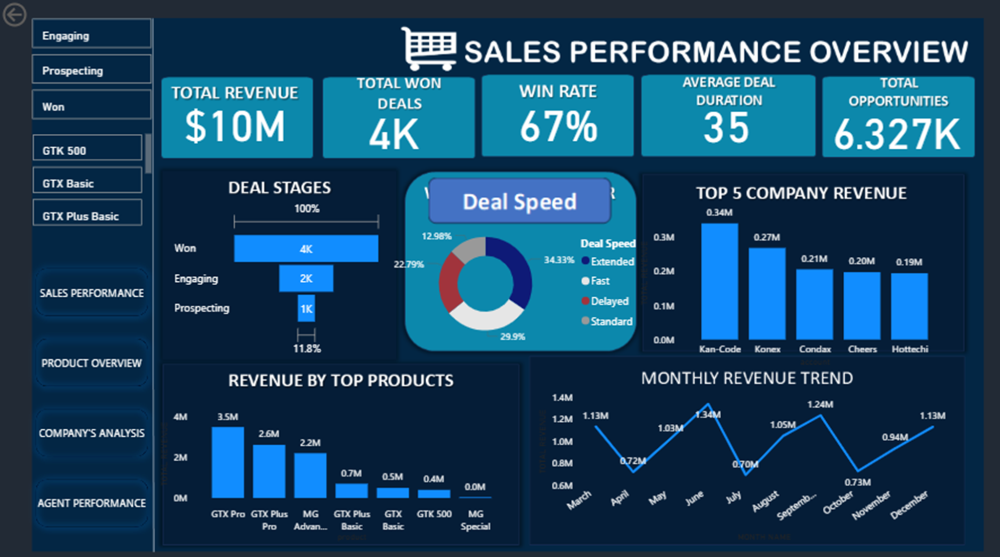
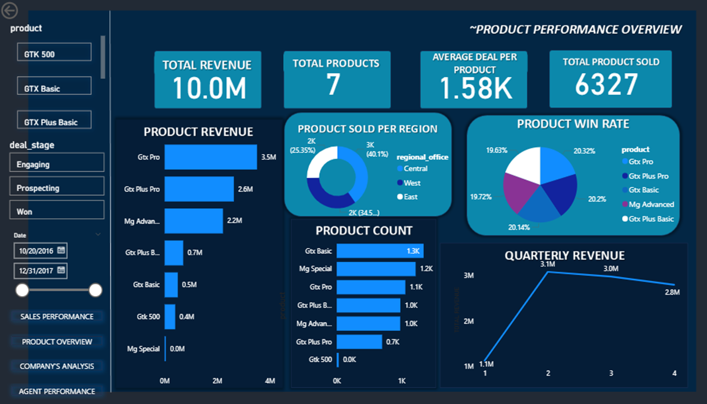
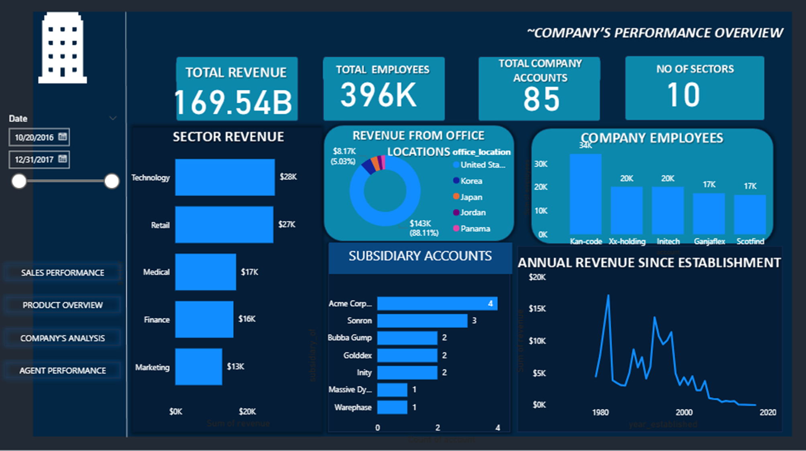

# sales-performance2-powerbi-analysis
Power BI analysis of sales performance across opportunities, products, company accounts, and sales agents.
# Sales Performance Analysis

## Project Overview

This project analyzes company sales performance across sales opportunities, products, customer accounts, and sales agents.

The Power BI dashboard provides an overview of revenue generation, deal performance, product performance, company accounts, and sales trends to identify the major factors contributing to overall sales performance.

## Business Question

How is the company performing across its sales pipeline, products, customer accounts, and sales agents, and what factors are driving revenue and deal performance?

## Tools Used

- Microsoft Power BI
- Power Query
- DAX
- Data Modeling
- Data Visualization

## Dashboard

### Sales Performance Overview

### Product Performance Overview

### Company Performance Overview

## Key Insights

- The sales pipeline generated approximately **$10 million in revenue** from about **6.33K sales opportunities**.

- Approximately **4K deals were won**, resulting in an overall **win rate of about 67%**.

- The average deal duration was approximately **35 days**, providing an indication of the typical time required to close sales opportunities.

- **GTX Pro** was the strongest-performing product by revenue, generating approximately **$3.5 million**, followed by GTX Plus Pro at approximately **$2.6 million**.

- Among the leading company accounts, **Kan-Code** generated the highest revenue at approximately **$0.34 million**, followed by Konex at approximately **$0.27 million**.

- Monthly revenue fluctuated considerably, reaching its highest visible level at approximately **$1.34 million in June**, with another strong period of approximately **$1.24 million in September**.

- Revenue performance varied considerably across products, accounts, and time periods, highlighting opportunities to investigate the factors associated with stronger deal conversion and revenue generation.

## Recommendations

- The company should investigate the characteristics of high-performing products such as **GTX Pro** to understand the factors contributing to their stronger revenue performance.

- Sales strategies used with high-value accounts such as **Kan-Code and Konex** should be examined for practices that could potentially be applied to other accounts.

- Monthly fluctuations in revenue should be investigated to determine whether they are associated with seasonality, sales campaigns, product demand, or changes in pipeline activity.

- Deal duration and win rate should be monitored together to identify opportunities to improve sales efficiency without negatively affecting conversion.

- Sales-agent performance should be evaluated using multiple measures, including revenue generated, deals won, win rate, and deal duration, rather than relying on a single performance metric.
